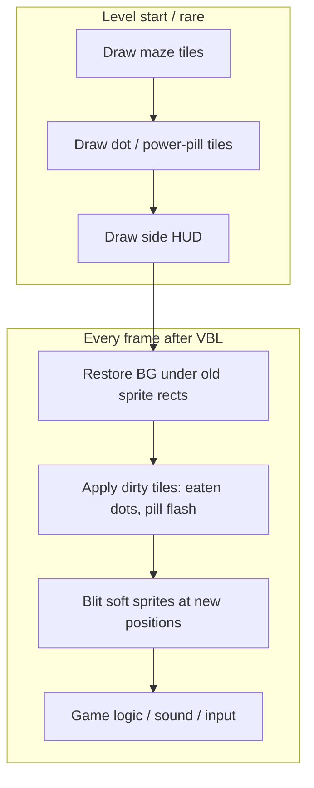

# Apple IIgs Design Guide

Design notes for porting arcade Ms. Pac-Man (`mspacmab`) to the Apple IIgs. This document records display and systems decisions as they are locked; remaining stubs are called out below.

| Section | Status |
|---------|--------|
| §1 Display & tile scale | **Locked** |
| §2 Color / SHR palette | TBD |
| §3 Sprite drawing | **Locked (v1)** |
| §3.1 Frame loop & VBL | **Locked (v1)** |
| §3.2 Graphics asset pipeline | **Locked (v1)** |
| §4 Input | **Locked (v1 keyboard)** |
| §5 Sound | TBD |
| §6 CPU / memory model | TBD |

Related: [Rom.Files.md](../Rom.Files.md) (arcade hardware / ROM map), [AGENTS.md](../AGENTS.md) (repo conventions).

---

## 1. Display & tile scale

### Arcade baseline

| Item | Value |
|------|--------|
| Full visible frame | 224×288 (portrait; cabinet CRT mounted 90°) |
| Full tile grid | 28×36 = 224×288 |
| Tile size | 8×8 |
| Typical row split | ~3 top (scores) + **31 maze** + ~2 bottom (lives / level fruit) |
| IIgs target mode | SHR **320×200**, 16 colors |

The arcade monitor is a normal 4:3 CRT on its side, so the physical screen is **3:4** portrait. The game’s tile engine still thinks in an 8×8, 28×36 grid.

### Layout decision: maze only, HUD on the sides

Do **not** render the full 36-row arcade frame on the IIgs.

- Move score, life counts, and level-fruit indicators into **side HUD panels**.
- The scaled playfield is the **maze only: 28×31 tiles** (224×248 arcade pixels).

That frees vertical resolution so tiles can be larger than if the full 36-row chrome stayed in-band.

### Fit constraint (integer tiles)

For tile size \(W \times H\) pixels on a 28×31 maze:

- \(28W \le 320\) → \(W \le 11\)
- \(31H \le 200\) → \(H \le 6\) (\(31 \times 6 = 186\); \(31 \times 7 = 217 > 200\))

Largest integer tile height is **6 px**. Arcade maze aspect is \(224:248 = 28:31\); displayed aspect with tiles \(W \times H\) is \((28W):(31H)\), which matches when **\(W = H\)** (square tiles).

Fitting all 36 rows instead would cap height at 5 px/tile. Dropping the HUD rows unlocks 5→6 and a cleaner scale (\(5/8 = 0.625\) → \(6/8 = 0.75\)).

### Chosen mapping

**Upright play, 6×6 pixel tiles, 28×31 maze; HUD on the sides.**

| | Arcade maze | IIgs |
|--|-------------|------|
| Tile | 8×8 | **6×6** |
| Grid | 28×31 | 28×31 |
| Playfield | 224×248 | **168×186** |
| Scale | — | \(6/8 = 0.75\) per axis |
| Screen | — | 320×200 SHR |
| Horizontal leftover | — | \(320 - 168 = 152\) px total (~76 per side if centered) |
| Vertical leftover | — | \(200 - 186 = 14\) px total (~7 per side if centered) |

Rationale:

- Fits the full maze with no row/column crop.
- Square tiles preserve maze aspect (no squash/stretch).
- Integer 6×6 blits are simpler on the 65816 than fractional scales.
- Side gutters (~76 px each if centered) hold score, lives, and level fruit.
- 0.75 scale is closer to native than a full-frame 0.625 mapping.

Sprites (arcade 16×16 = 2×2 tiles) become **12×12** under the same scale. Soft-sprite and frame-loop details are in [§3](#3-sprite-drawing) and [§3.1](#31-frame-loop--vbl).

```
Arcade 28×36 frame
        │
        ├─► 31-row maze (8×8) ──► scale 8→6 ──► playfield 168×186 ──┐
        │                                                             ├─► SHR 320×200
        └─► score / lives / fruit ─────────────────► side HUD (152 px leftover)
```

### Pixel aspect

On a true 3:4 portrait CRT, a 224×288 raster has pixel aspect ratio (PAR) ≈ \(0.964\) — about **4%** from square:

\[
\mathrm{PAR} = \frac{3/4}{224/288} = \frac{216}{224} \approx 0.964
\]

Treating IIgs framebuffer pixels as square, that mismatch is small enough to ignore. **Square logical pixels and 6×6 tiles remain the default.**

**Later caveat (not solved in v1):** real IIgs video on a 4:3 display makes SHR 320×200 pixels themselves non-square (PAR ≈ \(5/6\)). That host-display effect is larger than the arcade’s ~4% and is a CRT-compensation topic, not a reason to abandon 6×6.

### Rejected alternatives (base mapping)

| Alternative | Why not |
|-------------|---------|
| 5×5 on the full 36-row frame | Valid if HUD stays in-band; superseded once chrome moves to the sides |
| 7×6 / 8×6 (non-square) | Larger on screen but stretches or squashes the maze |
| Float tile sizes (~6.45) | Worse for tile drawing and collision alignment |
| Rotated sideways on a landscape TV | Authentic cabinet geometry; poor living-room UX |
| Crop maze rows to reach 7×7 | \(31 \times 7 = 217 > 200\); not worth losing playfield |

---

## 2. Color / SHR palette

TBD. Map arcade color PROM / tile attributes into SHR’s 16-color palette (from 4096). Scanline palette tricks are optional later.

---

## 3. Sprite drawing

### Arcade model (source of truth)

Arcade Ms. Pac-Man is **not** a framebuffer game. It composites two layers in hardware:

| Layer | Hardware | Role |
|-------|----------|------|
| Background | Tilemap in Video RAM `4000–43FF` + Color RAM `4400–47FF`; pixels from graphics ROM `5e` | Maze walls, dots, power pills, chrome text |
| Actors | Up to **six** 16×16 hardware sprites; pixels from graphics ROM `5f` | Red / pink / blue / orange ghost, Ms. Pac, fruit |

Each VBLANK the Z80 publishes sprite code/color and XY from a shadow buffer (`4Cxx`) into sprite RAM / position ports (`4FF2+`, `5062+`). The maze is drawn once per level (task table); afterward only **dirty** tile/color cells change (eaten dot, power-pill flash, HUD strings).

**Dots and power pills are tiles, not sprites.** Dots use tile code `#10` plus a bitfield at `4E16–4E33`. Power pills live in `4E34–4E37` and flash via tile/color RAM updates. Fruit is the sixth hardware sprite when active — not a maze tile.

Do **not** model the four power pills as soft sprites on the IIgs. Keep the soft-sprite set at **≤6 actors** (pac + 4 ghosts + fruit).

### IIgs mapping

| Layer | Arcade | IIgs (v1) |
|-------|--------|-----------|
| Mode | Tilemap + HW sprites | SHR **320×200**, 16 colors |
| Maze | 28×31 × 8×8 | 28×31 × **6×6** → 168×186 playfield |
| Actors | 6 × 16×16 HW | 6 × **12×12** soft sprites |
| Dots / power pills | Tile + color RAM | Dirty **tile** updates |
| HUD | Top/bottom tile rows | Side gutters (§1) |

### Soft-sprite rules (v1)

- Soft-blit actors over the 168×186 playfield only (HUD is separate).
- **Logical size 12×12; blit cell 14×12.** Visible art is 12×12 (arcade 16×16 at 0.75). Store and blit as a **14×12** cell with **masking** so the two extra horizontal pixels stay transparent. At 4bpp, 14 px = **exactly 7 bytes/row** — a fixed width for every sprite frame (even and odd).
- **Save-under restore:** each actor keeps an underlay for the 14×12 footprint: **7×12 = 84 bytes**. On erase, copy the underlay back; on draw, save destination pixels, then masked blit.
- **Dirty tiles win over stale underlays:** if a dot or power-pill tile under a sprite changes in the same frame, erase sprites first, redraw that tile, then draw sprites. Do not leave a saved underlay that still shows the uneaten dot.
- **Draw order (v1):** fruit, then Ms. Pac, then ghosts (back → front). When matching arcade eat-ghost / power-pill priority matters visually, adjust ghost↔pac order to match the VBLANK priority swaps in `mspac.asm`; fruit stays under the actors.
- Backup if save-under fights flashing pills: redraw the 6×6 tiles under the old sprite rect from the logical tilemap instead. Not the v1 default.

### Positioning & 4bpp packing (locked)

SHR **320** mode stores **two pixels per byte** (4 bits each). That constrains horizontal blits, not gameplay motion.

| Axis | Decision |
|------|----------|
| **X** | **Arbitrary pixel** positions (1 IIgs-pixel steps). Do **not** restrict sprites to byte boundaries (even X only). Byte-aligned-only would halve horizontal resolution on the 168-wide playfield and feel wrong against 6×6 tiles. |
| **Y** | Arbitrary row — no packing constraint. |

**Asset storage (locked):**

1. Ship / store only the **even** form of each frame: 14×12 pixels packed to **7 bytes × 12 rows**, plus a matching 7×12 mask (transparent padding in the two extra columns).
2. At **startup**, generate the **odd** form from each even asset (nibble-shift pixels/mask one pixel right into the same 7-byte-wide cell).
3. At draw time, pick even or odd by `X & 1`. Both forms are the same byte width — no variable-width blit path.

| Sprite X | Screen start | Runtime asset |
|----------|--------------|----------------|
| even | high nibble of a byte | stored even form + mask |
| odd | low nibble (straddles bytes) | startup-generated odd form + mask |

### Blit implementation sequence

1. **v1:** table-driven masked soft blit over the fixed 7-byte-wide even/odd forms + save-under (prove the frame budget in §3.1).
2. **Later (if measured need):** compile hot draw/erase paths to unrolled **65816** from the same even masters (odd still generated at startup, or baked by the generator). Do not hand-maintain a huge compiled sheet first.



---

## 3.1 Frame loop & VBL

### Decision

**VBL-synced erase → dirty tiles → redraw sprites.** Do not trail the beam in v1. Do not require the entire hot path to finish inside the blanking interval alone — sync to the VBL edge, then spend the frame budget.

### Per-frame loop

1. `waitForVbl` (poll input while waiting).
2. Erase actors at **previous** positions (restore save-under buffers).
3. Apply dirty playfield tiles (dot eaten, power-pill blink, rare maze flash).
4. Draw fruit / pac / ghosts at **new** positions.
5. Run logic / sound / score dirty updates (may continue past blanking).

Level start (and rare full rebuilds) draw maze tiles, dots/power pills, and side HUD once; the per-frame path never full-clears the playfield.

### Why this shape

| Approach | Verdict |
|----------|---------|
| Finish all erase/draw inside ~4.5 ms VBL only | Rejected for v1. At 2.8 MHz that is ~12k cycles — tight for masked erase+draw of 6×12×12. |
| Sync to VBL, then erase/draw/logic on the full frame | **Chosen.** ~41–46k cycles/frame at 60 Hz is enough for six small sprites plus sparse dirty tiles. |
| Trail the beam (draw only behind the raster) | Deferred. More complex; revisit only if tearing or missed frames show up under measurement (e.g. border-color timing). |

### Cycle-budget sketch

Numbers are order-of-magnitude checks, not a commitment to a blit implementation:

| Work | Size |
|------|------|
| Full playfield 168×186 @ 4bpp | ≈ 15.6 KB — **do not** redraw every frame |
| One 14×12 sprite cell @ 4bpp | 84 bytes |
| Six actors erase + draw | 504 bytes touched each way |
| One dirty 6×6 tile | 18 bytes |
| Hot path | ~6 erase + ≤6 draw + a handful of dirty tiles |

Conclusion: soft-sprite erase/redraw at 60 Hz is plausible; a full maze redraw every frame is not the plan.

### Shadowing

Write SHR through bank `$01` shadow at full CPU speed. Avoid long poke loops into bank `$E1` (Mega II / 1 MHz path).

- **v1:** draw with shadowing on (direct shadow writes that mirror to the screen).
- **v1.1 (if needed):** draw into a shadow buffer with shadowing off, then PEI / dirty-rect refresh with shadowing on — only if v1 misses frame budget.

### Prior art

| Reference | What to take |
|-----------|----------------|
| [GS.Pacman](https://github.com/peterhirschberg/GS.Pacman) (Peter Hirschberg) | Best Pac-Man-specific IIgs reference (external). ORCA/65816, SHR 320, `waitForVbl` → `eraseGhosts` / `erasePac` → `drawFruit` / `drawPac` / `drawGhosts` → logic/sound; maze drawn once in `drawMaze`. |
| BuGS (local disks under `IIgsDisks/`) | Centipede soft-sprite / fixed-fps precedent (Mr. Sprite / John Brooks). Useful for blit technique, not maze semantics. |
| This repo | No IIgs game code yet. Arcade truth remains `mspac.asm` + golden `boot1`–`boot6`. |

### Non-goals (this design pass)

- No 65816 implementation or IIgs scaffolding here (Z80 reassembly pipeline still comes first — see [AGENTS.md](../AGENTS.md)).
- No final palette (§2).
- No beam-trailing plan beyond “measure first, then consider.”

---

## 3.2 Graphics asset pipeline

### Decision

Generate IIgs tile/sprite bitmaps **automatically** from the arcade graphics ROMs as a build step. Do not hand-author 6×6 / 12×12 sheets as the source of truth.

| Input | Source | Output |
|-------|--------|--------|
| Tiles | `mspacman-orig/5e` (256 × 8×8, 2bpp) | `build/gfx/tiles6.bin` — 256 × **6×6** @ 4bpp (3 bytes/row) |
| Sprites | `mspacman-orig/5f` (64 × 16×16, 2bpp) | `build/gfx/sprites14x12.bin` + `.mask.bin` — 64 × **14×12** even cells (7 bytes/row) |

Scale factor is \(6/8 = 0.75\) for both (8→6, 16→12). Sprites are then padded to the locked 14×12 masked cell (12 px art left-aligned, 2 transparent columns on the right). **Odd** forms are **not** emitted by the build — the IIgs generates them at startup from the even masters (§3).

### Algorithm

1. Decode `5e` / `5f` with the MAME `pacman` char/sprite bit layouts → pen maps (indices 0–3).
2. **Area-resample** (coverage-weighted majority vote) to 6×6 / 12×12, keeping pens (not baked RGB).
3. Pad each 12×12 sprite to 14×12; build a matching mask (opaque where pen ≠ 0).
4. Pack SHR 320 **4bpp** (high nibble = left pixel).
5. Optional: write **PPM** contact sheets under `build/gfx/ppm/` for eyeballing (uses color/palette PROMs when present).

Pen 0 remains transparency for sprites. Final SHR palette mapping is still §2; assets store pen indices in the low bits of each nibble.

### Build

```bash
make gfx        # binaries only
make gfx-ppm    # binaries + PPM previews (default zoom ×4)
# or:
python3 py/gen_shr_gfx.py --ppm --out build/gfx
```

Helper: [`py/gen_shr_gfx.py`](../py/gen_shr_gfx.py).

---

## 4. Input

### Decision (v1)

Simulate the arcade **4-way stick** with keyboard **any-key-down** (level-sensitive held keys, not edge-triggered presses). Poll during the VBL wait / frame loop the same way game logic already samples the stick each tick.

| Direction | Key |
|-----------|-----|
| Up | **A** |
| Down | **Z** |
| Left | **←** (left arrow) |
| Right | **→** (right arrow) |

- Multiple held keys: last meaningful direction wins for intent, or prefer the axis that matches arcade “intended direction” buffering if that logic is ported — do not require diagonals (arcade stick is 4-way only).
- Start / coin (credit) / pause remain TBD; joystick hardware can be added later without changing this keyboard map.

---

## 5. Sound

TBD. Arcade Namco WSG → IIgs Ensoniq DOC (or simpler square/noise approximation for an early milestone).

---

## 6. CPU / memory model

TBD. 65816 organization, how much of the Z80 game logic is reimplemented vs translated, and where tilemaps / sprite sheets live in banked RAM / FastPath.
