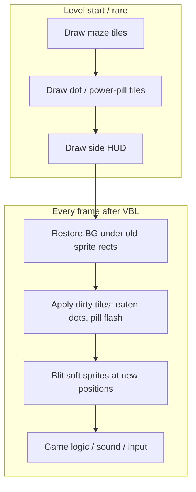

# Apple IIgs Design Guide

Design notes for porting arcade Ms. Pac-Man (`mspacmab`) to the Apple IIgs. This document records display and systems decisions as they are locked; remaining stubs are called out below.

| Section | Status |
|---------|--------|
| §1 Display & tile scale | **Locked** |
| §2 Color / SHR palette | **Capacity locked** (13/16; target pack + fruit prebake live) |
| §3 Sprite drawing | **Locked (v1)** |
| §3.1 Frame loop & VBL | **Locked (v1)** |
| §3.2 Graphics asset pipeline | **Locked (v1)** |
| §3.3 Render harness (Merlin32) | **Scaffolding live** |
| §4 Input | **Locked (v1 keyboard)** |
| §5 Sound | TBD |
| §6 CPU / memory model | **Harness map locked (v1)** |

Related: [Rom.Files.md](../Rom.Files.md) (arcade hardware / ROM map), [AGENTS.md](../AGENTS.md) (repo conventions).

---

## 1. Display & tile scale

### Arcade baseline

| Item | Value |
|------|--------|
| Full visible frame | 224×288 (portrait; cabinet CRT mounted 90°) |
| Full tile grid | 28×36 = 224×288 |
| Tile size | 8×8 |
| Typical row split | ~3 top (scores) + **31 maze** + ~2 bottom (lives / level fruit) |
| IIgs target mode | SHR **320×200**, 16 colors |

The arcade monitor is a normal 4:3 CRT on its side, so the physical screen is **3:4** portrait. The game’s tile engine still thinks in an 8×8, 28×36 grid.

### Layout decision: maze only, HUD on the sides

Do **not** render the full 36-row arcade frame on the IIgs.

- Move score, life counts, and level-fruit indicators into **side HUD panels**.
- The scaled playfield is the **maze only: 28×31 tiles** (224×248 arcade pixels).

That frees vertical resolution so tiles can be larger than if the full 36-row chrome stayed in-band.

### Fit constraint (integer tiles)

For tile size \(W \times H\) pixels on a 28×31 maze:

- \(28W \le 320\) → \(W \le 11\)
- \(31H \le 200\) → \(H \le 6\) (\(31 \times 6 = 186\); \(31 \times 7 = 217 > 200\))

Largest integer tile height is **6 px**. Arcade maze aspect is \(224:248 = 28:31\); displayed aspect with tiles \(W \times H\) is \((28W):(31H)\), which matches when **\(W = H\)** (square tiles).

Fitting all 36 rows instead would cap height at 5 px/tile. Dropping the HUD rows unlocks 5→6 and a cleaner scale (\(5/8 = 0.625\) → \(6/8 = 0.75\)).

### Chosen mapping

**Upright play, 6×6 pixel tiles, 28×31 maze; HUD on the sides.**

| | Arcade maze | IIgs |
|--|-------------|------|
| Tile | 8×8 | **6×6** |
| Grid | 28×31 | 28×31 |
| Playfield | 224×248 | **168×186** |
| Scale | — | \(6/8 = 0.75\) per axis |
| Screen | — | 320×200 SHR |
| Horizontal leftover | — | \(320 - 168 = 152\) px total (~76 per side if centered) |
| Vertical leftover | — | \(200 - 186 = 14\) px total (~7 per side if centered) |

Rationale:

- Fits the full maze with no row/column crop.
- Square tiles preserve maze aspect (no squash/stretch).
- Integer 6×6 blits are simpler on the 65816 than fractional scales.
- Side gutters (~76 px each if centered) hold score, lives, and level fruit.
- 0.75 scale is closer to native than a full-frame 0.625 mapping.

Sprites (arcade 16×16 = 2×2 tiles) become **12×12** under the same scale. Soft-sprite and frame-loop details are in [§3](#3-sprite-drawing) and [§3.1](#31-frame-loop--vbl).

```
Arcade 28×36 frame
        │
        ├─► 31-row maze (8×8) ──► scale 8→6 ──► playfield 168×186 ──┐
        │                                                             ├─► SHR 320×200
        └─► score / lives / fruit ─────────────────► side HUD (152 px leftover)
```

### Pixel aspect

On a true 3:4 portrait CRT, a 224×288 raster has pixel aspect ratio (PAR) ≈ \(0.964\) — about **4%** from square:

\[
\mathrm{PAR} = \frac{3/4}{224/288} = \frac{216}{224} \approx 0.964
\]

Treating IIgs framebuffer pixels as square, that mismatch is small enough to ignore. **Square logical pixels and 6×6 tiles remain the default.**

**Later caveat (not solved in v1):** real IIgs video on a 4:3 display makes SHR 320×200 pixels themselves non-square (PAR ≈ \(5/6\)). That host-display effect is larger than the arcade’s ~4% and is a CRT-compensation topic, not a reason to abandon 6×6.

### Rejected alternatives (base mapping)

| Alternative | Why not |
|-------------|---------|
| 5×5 on the full 36-row frame | Valid if HUD stays in-band; superseded once chrome moves to the sides |
| 7×6 / 8×6 (non-square) | Larger on screen but stretches or squashes the maze |
| Float tile sizes (~6.45) | Worse for tile drawing and collision alignment |
| Rotated sideways on a landscape TV | Authentic cabinet geometry; poor living-room UX |
| Crop maze rows to reach 7×7 | \(31 \times 7 = 217 > 200\); not worth losing playfield |

---

## 2. Color / SHR palette

### Decision

Map the arcade **color PROM** (`82s123.7f`) and **palette PROM** (`82s126.4a`) into **one SHR palette 0** (16 pens). **Capacity is locked: everything fits.**

With SHR **shadowing on**, the harness owns bank `$01`:

| Range | Role |
|-------|------|
| `$9D00–$9DFF` | SCB — one byte per scanline; low nibble selects palette 0–15 (we use **0**, 320 mode) |
| `$9E00–$9FFF` | 16 palettes × 32 bytes; **palette 0** at `$9E00` holds pens 0–15 |

Build: `make palette` → `build/gfx/palette.bin` + generated `iigs/palette_data.s` ([`py/gen_palette.py`](../py/gen_palette.py)). `LoadPalette` writes palette 0 at `$01/9E00` only (no `$E1` poke).

Scanline palette tricks (SCB ≠ 0) remain optional later.

### Capacity verdict (locked)

The color PROM has only **12 unique non-black RGBs** (four of its 16 entries are duplicate black). Every maze wall bank, ghost, fruit, Ms. Pac, and HUD color in Ms. Pac-Man is chosen from that set.

| Budget | Count |
|--------|------:|
| Black / transparency | 1 |
| Distinct arcade chromatic RGBs | 12 |
| **Required** | **13** |
| SHR pens available | 16 |
| **Free** | **3** |

Those free pens cover `COL_POWER` fade (animates an existing pale RGB — does not invent a 13th hue), optional markers, and one spare.

Fruit, ghosts, and maze **share** many RGBs (cherry red = Blinky red, Clyde orange = peach fruit accent, eye pale = pellet pale, etc.). Pinky pink and Inky cyan are ghost-only; green / pear-teal are fruit-only. Sharing is required and desirable — one global pen per RGB.

**Not a capacity problem:** arcade hardware gives each tile/sprite cell its own 4-entry palette bank via color RAM. SHR cannot. We solve that by **prebaking** final SHR pen indices into pixel data (below), not by allocating a private bank per object.

### Prebake model (asset pipeline)

Arcade graphics are **2bpp**: each pixel is palette-bank pen 0–3. At runtime the hardware looks up that pen in the cell’s color-RAM bank. On the IIgs there is no per-cell bank — only palette 0.

**Pipeline rule:** Python asset generators resolve `(sprite_or_tile, arcade_color_bank, 2bpp_pen) → SHR pen` using the known color tables, and write **4bpp bitmaps already indexed into palette 0**.

| Source | Known color choice | Prebake does |
|--------|-------------------|--------------|
| Maze tiles | Level maze bank from `#95AE` (`#1D`, `#16`, `#14`, `#07`, `#18`, …) | Map bank pens 0–3 → SHR pens for that maze (level start may rewrite palette words 0–3; tile pixels stay on fixed SHR indices for ink roles) |
| Dots `#10` | Maze pale | SHR pen **1** |
| Power pills `#14`/`#15` | Same pale as dots on arcade; dedicated fade pen on IIgs | SHR pen **14** (`COL_POWER`) |
| Ghosts `$20–$27` | Sprite color `#01/#03/#05/#07` (body) + eyes | Eye white → pen 1; pupil → pen 15; body → pens **5/7/9/11** (`COL_*`); compiled blits bake body color |
| Frightened `#11`/`#12` | Blue / flash banks | Prebake or swap body pens to the matching PROM RGBs already in the table |
| Moving fruit `$00–$07` | Ms. Pac table `#879D` (sprite + color bank) | Even/odd compiled blits with **all four bank pens resolved to SHR indices** (no runtime recolor) |
| HUD fruit strip | Tile bases `#90+` + colors at `#3B08` (max **7** icons; tiles, not actors) | Precolored HUD bitmaps / tile blits from the same RGB→pen map |
| Ms. Pac | Yellow bank `#09` (and related) | Prebake yellow / red / blue accents onto pens **13** / **5** / **15** etc. |

Harness today still uses a partial pack (`gen_palette.py` maze `#1D` in 0–3 + color-ROM 0–11 in 4–15, omitting green/teal). That is demo scaffolding. The **target** is: one fixed RGB→pen map covering all 12 chromatic colors; generators emit correct indices; runtime almost never remaps pixels.

### Full arcade RGB set → target SHR pens

Decoded with MAME `pacman` weights from `82s123.7f`. Color-ROM indices in brackets.

| Pen | SHR `$0RGB` | RGB | Color ROM | Roles |
|-----|-------------|-----|-----------|--------|
| **0** | `$0000` | `(0,0,0)` | 0/4/8/10 | Black, empty path, sprite transparency |
| **1** | `$0DDF` | `(222,222,255)` | 15 | Dots, eye white, fruit highlight, many maze pen1s |
| **2** | `$0FBA` | `(255,184,174)` | 14 | Maze `#1D` wall fill; some chrome / frightened accents |
| **3** | `$0F00` | `(255,0,0)` | 1 | Maze `#1D` wall ink; **shared with Blinky / cherry red** (alias ok — same RGB as pen 5) |
| **4** | `$00F0` | `(0,255,0)` | 12 | **Green** — strawberry leaf, peach leaf, pear, frightened-bank accents |
| **5** | `$0F00` | `(255,0,0)` | 1 | `COL_BLINKY`; cherry / strawberry / apple body |
| **6** | `$0D95` | `(222,151,81)` | 2 | Brown — fruit stems, maze `#14` accents; ghost `BODY_PEN` marker when needed |
| **7** | `$0FBF` | `(255,184,255)` | 3 | `COL_PINKY`; maze `#18` pink |
| **8** | `$04BA` | `(71,184,174)` | 13 | **Teal** — pear HUD bank `#17` |
| **9** | `$00FF` | `(0,255,255)` | 5 | `COL_INKY`; maze `#18` cyan |
| **10** | `$04BF` | `(71,184,255)` | 6 | Light blue — banana / maze `#16` |
| **11** | `$0FB5` | `(255,184,81)` | 7 | `COL_CLYDE`; peach / pretzel orange; maze `#07` |
| **12** | — | — | — | **Spare** |
| **13** | `$0FF0` | `(255,255,0)` | 9 | Ms. Pac body; banana; maze `#16`/`#18` yellow |
| **14** | `$0DDF` → fade | `(222,222,255)` base | 15 | **`COL_POWER`** — power-pill fade (same RGB as pen 1 at full bright) |
| **15** | `$022F` | `(33,33,255)` | 11 | Ghost pupils; pretzel blue; maze `#07` deep blue |

| Consumer | Pens (target) |
|----------|----------------|
| Maze tiles | 0 + level bank’s three chromatics (subset of 1–3, 6–7, 9–11, 13, 15, …) |
| Dots | 0, **1** |
| Power pills | 0, **14** |
| Ghosts | 0, 1, 15, body **5/7/9/11** |
| Fruit (actor + HUD) | baked mix of 1, 4–6, 8, 10–11, 13, 15 (and red via 5) |
| Ms. Pac | 0, 13 (yellow), plus 5 / 15 accents as bank `#09` requires |

Pens **3** and **5** may hold the same red word; keeping both simplifies “maze ink” vs `COL_BLINKY` naming. Pen **12** is the leftover spare after green/teal/`COL_POWER` claim the former duplicate-black holes.

### Harness note

`gen_palette.py` emits the §2 target map (green/teal/`COL_POWER` included). Fruit compiled blits prebake bank colors into those pens. Power-pill tiles still use pen **1** until fade remap lands.

### Power-pill fade

Arcade blinks energizers by toggling **color RAM** between the maze color and black every 10 VBLANKs (`#0C0D` → Ms. Pac `FLASHEN` at `#9524`). On SHR: pixels use pen **14**; each fade step rewrites `$01/9E00 + 14*2` only. All four pills stay in sync; dots on pen **1** stay steady.

| Item | Choice |
|------|--------|
| Pen | **14** (`COL_POWER`) |
| Full-bright RGB | Same as pen 1 (`$0DDF`) |
| Asset | Prebake `#14`/`#15` tiles to pen 14 |
| Timing default | 10-frame envelope (arcade counter `#4DCF` / `#0A`) unless playtest changes it |
| Maze bank swap | Refresh pen 14’s full-bright base when maze pale changes |

---

## 3. Sprite drawing

### Arcade model (source of truth)

Arcade Ms. Pac-Man is **not** a framebuffer game. It composites two layers in hardware:

| Layer | Hardware | Role |
|-------|----------|------|
| Background | Tilemap in Video RAM `4000–43FF` + Color RAM `4400–47FF`; pixels from graphics ROM `5e` | Maze walls, dots, power pills, chrome text |
| Actors | Up to **six** 16×16 hardware sprites; pixels from graphics ROM `5f` | Red / pink / blue / orange ghost, Ms. Pac, fruit |

Each VBLANK the Z80 publishes sprite code/color and XY from a shadow buffer (`4Cxx`) into sprite RAM / position ports (`4FF2+`, `5062+`). The maze is drawn once per level (task table); afterward only **dirty** tile/color cells change (eaten dot, power-pill flash, HUD strings).

**Dots and power pills are tiles, not sprites.** Dots use tile code `#10` plus a bitfield at `4E16–4E33`. Power pills live in `4E34–4E37` and flash via tile/color RAM updates. Fruit is the sixth hardware sprite when active — not a maze tile.

Do **not** model the four power pills as soft sprites on the IIgs. Keep the soft-sprite set at **≤6 actors** (pac + 4 ghosts + fruit).

### IIgs mapping

| Layer | Arcade | IIgs (v1) |
|-------|--------|-----------|
| Mode | Tilemap + HW sprites | SHR **320×200**, 16 colors |
| Maze | 28×31 × 8×8 | 28×31 × **6×6** → 168×186 playfield |
| Actors | 6 × 16×16 HW | 6 × **12×12** soft sprites |
| Dots / power pills | Tile + color RAM | Dirty **tile** updates |
| HUD | Top/bottom tile rows | Side gutters (§1) |

### Soft-sprite rules (v1)

- Soft-blit actors over the 168×186 playfield only (HUD is separate).
- **Logical size 12×12; blit cell 14×12.** Visible art is 12×12 (arcade 16×16 at 0.75). Store and blit as a **14×12** cell with **masking** so the two extra horizontal pixels stay transparent. At 4bpp, 14 px = **exactly 7 bytes/row** — a fixed width for every sprite frame (even and odd).
- **Save-under restore:** each actor keeps an underlay for the 14×12 footprint: **7×12 = 84 bytes**. On erase, copy the underlay back; on draw, save destination pixels, then masked blit.
- **Dirty tiles win over stale underlays:** if a dot or power-pill tile under a sprite changes in the same frame, erase sprites first, redraw that tile, then draw sprites. Do not leave a saved underlay that still shows the uneaten dot.
- **Draw order (v1):** fruit, then Ms. Pac, then ghosts (back → front). When matching arcade eat-ghost / power-pill priority matters visually, adjust ghost↔pac order to match the VBLANK priority swaps in `mspac.asm`; fruit stays under the actors.
- Backup if save-under fights flashing pills: redraw the 6×6 tiles under the old sprite rect from the logical tilemap instead. Not the v1 default.

### Positioning & 4bpp packing (locked)

SHR **320** mode stores **two pixels per byte** (4 bits each). That constrains horizontal blits, not gameplay motion. Tile rows are **3 bytes** (6 px) and sprite save-under rows **7 bytes** (14 px). Use **overlapped 16-bit** copies: tiles word@0 + word@1; sprites words@0,2,4 + word@5 — never a plain word store that extends past the cell (that spills into the next SHR byte / next save row). Masked sprite blit stays per-byte/nibble.

| Axis | Decision |
|------|----------|
| **X** | **Arbitrary pixel** positions (1 IIgs-pixel steps). Do **not** restrict sprites to byte boundaries (even X only). To sit a sprite on a maze tile, use `PF_ORIGIN_X + tile*6 + SPR_OFF_X` with **`SPR_OFF_X = -4`** (art is centered in the 14-wide cell; left-aligning at the tile origin overhangs only the right wall). |
| **Y** | **`SPR_OFF_Y = -3`** centers 12px art on the 6px tile. |

**Asset storage (locked):**

1. Ship / store only the **even** form of each frame: 14×12 pixels packed to **7 bytes × 12 rows**, plus a matching 7×12 mask. Art is **centered** in the cell (1 transparent column left + 1 right).
2. **Odd** forms are precomputed by `py/gen_shr_gfx.py` (`sprites14x12.odd.bin` + `.odd.mask.bin`) — nibble-shift one pixel right into the same 7-byte cell — and injected with the even assets. (On-target `GenOddSprites` is deferred; host-side shift is the harness source of truth.)
3. At draw time, pick even or odd by `X & 1`. Both forms are the same byte width — no variable-width blit path.

| Sprite X | Screen start | Runtime asset |
|----------|--------------|----------------|
| even | high nibble of a byte | stored even form + mask |
| odd | low nibble (straddles bytes) | startup-generated odd form + mask |

### Blit implementation sequence

1. **Ghosts:** build-time **compiled** masked blits (`py/gen_compiled_ghosts.py`) for walk frames `$20–$27` × 4 body colors × even/odd; save-under still unrolled data copies.
2. **Fruit (demo):** `py/gen_compiled_fruits.py` — 8 types × even/odd, colors prebaked from `#879D`. Harness actor 4 sits at fixed tile (14,17); `AdvanceFruit` cycles `ACT_SPR` every 360 frames. HUD fruit strip still TBD (precolored tiles, not actors).
3. **Ms. Pac (later):** same compiled-blit pattern; keep erase as save-under restore.



---

## 3.1 Frame loop & VBL

### Decision

**Erase(old) → draw(new) → commit old←new → logic → WaitVBL.** Actor registers hold both **new** (`ACT_X`/`ACT_Y`, written by game/rails) and **old** (`ACT_OX`/`ACT_OY`, last drawn). Move/logic must not sit between erase and draw (that lengthens the invisible hole and flickers). Do not trail the beam with per-sprite scanline waits in v1.

### Per-frame loop

1. Erase actors at **old** positions (`ACT_OX`/`ACT_OY` — restore save-under).
2. Apply dirty playfield tiles when present (dot eaten, power-pill blink).
3. Draw actors at **new** positions (`ACT_X`/`ACT_Y`).
4. `CopySpritePos`: old ← new.
5. Run logic / rails / sound (writes next **new** XY; rails also update `ACT_SPR`).
6. `WaitVBL` (poll input around this edge), then loop.

Level start draws maze once, draws sprites at initial new (== old), commits, then enters the loop.

### Why this shape

| Approach | Verdict |
|----------|---------|
| Finish all erase/draw inside ~4.5 ms VBL only | Rejected for v1. At 2.8 MHz that is ~12k cycles — tight for masked erase+draw of 6×12×12. |
| Erase → move → draw (move in the hole) | Rejected — long invisible gap → flicker. |
| Erase(old) → draw(new) → commit → logic → VBL | **Chosen.** Tight blit pair; logic publishes next frame’s new regs after sprites are visible. |
| Trail the beam (per-sprite scanline waits) | Not used in v1 — deferred redraws caused worse flicker than tear. |
| Y-sort erase/draw (no beam wait) | **Used** — erase by `ACT_OY`, draw by `ACT_Y`, top→bottom so upper sprites update before the beam reaches them. |

### Cycle-budget sketch

Numbers are order-of-magnitude checks, not a commitment to a blit implementation:

| Work | Size |
|------|------|
| Full playfield 168×186 @ 4bpp | ≈ 15.6 KB — **do not** redraw every frame |
| One 14×12 sprite cell @ 4bpp | 84 bytes |
| Six actors erase + draw | 504 bytes touched each way |
| One dirty 6×6 tile | 18 bytes |
| Hot path | ~6 erase + ≤6 draw + a handful of dirty tiles |

Conclusion: soft-sprite erase/redraw at 60 Hz is plausible; a full maze redraw every frame is not the plan.

### Shadowing

Write SHR through bank `$01` shadow at full CPU speed. Avoid long poke loops into bank `$E1` (Mega II / 1 MHz path).

- **v1:** draw with shadowing on (direct shadow writes that mirror to the screen).
- **v1.1 (if needed):** draw into a shadow buffer with shadowing off, then PEI / dirty-rect refresh with shadowing on — only if v1 misses frame budget.

### Prior art

| Reference | What to take |
|-----------|----------------|
| [GS.Pacman](https://github.com/peterhirschberg/GS.Pacman) (Peter Hirschberg) | Best Pac-Man-specific IIgs reference (external). ORCA/65816, SHR 320, `waitForVbl` → `eraseGhosts` / `erasePac` → `drawFruit` / `drawPac` / `drawGhosts` → logic/sound; maze drawn once in `drawMaze`. |
| BuGS (local disks under `IIgsDisks/`) | Centipede soft-sprite / fixed-fps precedent (Mr. Sprite / John Brooks). Useful for blit technique, not maze semantics. |
| This repo | Merlin32 render module + GSSquared harness under [`iigs/`](../iigs/); arcade truth remains locked `mspac.asm` + `boot1`–`boot6`. |

### Non-goals (still)

- Power-pill fade remap (pen 14) and HUD fruit strip not wired yet.
- No beam-trailing plan beyond “measure first, then consider.”
- No full game logic / Z80 translation yet.

---

## 3.2 Graphics asset pipeline

### Decision

Generate IIgs tile/sprite bitmaps **automatically** from the arcade graphics ROMs as a build step. Do not hand-author 6×6 / 12×12 sheets as the source of truth.

| Input | Source | Output |
|-------|--------|--------|
| Tiles | `mspacman-orig/5e` (256 × 8×8, 2bpp) | `build/gfx/tiles6.bin` — 256 × **6×6** @ 4bpp (3 bytes/row) |
| Sprites | `mspacman-orig/5f` (64 × 16×16, 2bpp) | `build/gfx/sprites14x12.bin` + `.mask.bin` — 64 × **14×12** even cells (7 bytes/row) |

Scale factor is \(6/8 = 0.75\) for both (8→6, 16→12). Sprites are then padded to the locked 14×12 masked cell (12 px art left-aligned, 2 transparent columns on the right). **Odd** forms are **not** emitted by the build — the IIgs generates them at startup from the even masters (§3).

### Algorithm

1. Decode `5e` / `5f` with the MAME `pacman` char/sprite bit layouts → pen maps (indices 0–3).
2. **Upright tiles/sprites:** rotate 90° CW (MAME `ROT90`), then **row XOR 3** (`out[i]=in[i^3]` — reverse each 4-row half). That fixes bevel direction without a full V-flip, which would open a black gap through two-tile horizontal walls (`DF`/`E5`). Same transform for sprites so 16→12 scale does not sample empty gap rows.
3. **Symmetric nearest subsample** 8→6 / 16→12 (keeps edge pixels for thin wall stems). Replace dot tiles `#10`/`#11` with a centered 2×2 and power pills `#14`/`#15` with a solid disc (ROM+scale otherwise yields a colon / H-bowtie).
4. Pad each 12×12 sprite to 14×12; build a matching mask (opaque where pen ≠ 0).
5. Pack SHR 320 **4bpp** (high nibble = left pixel).
6. Maze build also emits **`maze1_cells.bin`**: per-cell 6×6 copies with shared-edge stitching (narrow lines meet at corners).
7. Optional: write **PPM** contact sheets under `build/gfx/ppm/` for eyeballing (uses color/palette PROMs when present).

Pen 0 remains transparency for sprites. Asset generators **prebake** §2 target pen indices into each nibble (resolve arcade 2bpp + color bank → SHR pen); do not ship raw bank-local 0–3 indices for actors/fruit/HUD.

### Build

```bash
make gfx        # binaries only
make gfx-ppm    # binaries + PPM previews (default zoom ×4)
make tiles-preview              # 8×8 maze + sheet (production upright = CW+row^3)
make tiles-preview COMPARE=native,cw,upright
# or:
python3 py/gen_shr_gfx.py --ppm --out build/gfx
python3 py/preview_tiles_8x8.py --orient upright --compare native,cw
```


Helpers: [`py/gen_shr_gfx.py`](../py/gen_shr_gfx.py), [`py/preview_tiles_8x8.py`](../py/preview_tiles_8x8.py) (8×8 only — validate rotate/flip before 6×6).

Level-1 maze tilemap (walls RLE + dots + power pills → upright 28×31):

```bash
make maze    # → build/gfx/maze1_28x31.bin (+ maze1_color.bin)
```

Helper: [`py/gen_maze1.py`](../py/gen_maze1.py).

---

## 3.3 Render harness (Merlin32 + GSSquared)

### Decision

First on-target milestone: a **65816 soft-render module** (tiles + masked soft sprites + save-under) driven by a GSSquared inject/run test — not a full game.

| Piece | Path |
|-------|------|
| Merlin32 sources | [`iigs/`](../iigs/) (`all.s` + `*_body.s`, link → `build/iigs/harness.bin`) |
| Host driver | [`py/gs2_render_test.py`](../py/gs2_render_test.py) |
| SHR → PNG | [`py/shr_dump_png.py`](../py/shr_dump_png.py) |

```bash
make iigs        # Merlin32 assemble
make iigs-test   # spawn GSSquared, inject, CALL 768, dump build/iigs/frame.png
```

**Boot into Applesoft:** wait ~5s after spawn → **Control-Reset** (Ctrl+F12; not Control-OA-Reset) → BASIC `%` prompt → poke trampoline at `$00/0300` → type `CALL 768`.

Harness maze tiles must match `make gfx` upright orientation (CW + row XOR 3). Ground-truth previews: `build/gfx/ppm/maze1_8x8_upright.png` / `maze1_6x6_upright.png`.

**Rail demo:** four ghosts tour a shared pellet-tile waypoint loop (`py/gen_ghost_rails.py` → `iigs/rails_data.s`). Rails write **new** `ACT_X`/`ACT_Y` and `ACT_SPR` (arcade facing `$20–$27`: `dir×2 + ((FRAME_COUNT>>3)&1) + $20`). Draw uses **compiled** masked blits (`py/gen_compiled_ghosts.py` → `GhostBlitTable`, color×frame×parity); no per-frame `PrepOneGhost` / `SPR_WORK*`. A fifth actor (fruit) sits at fixed tile (14,17) with prebaked `FruitBlitTable` blits; `AdvanceFruit` cycles type `$00–$07` every 360 frames. Erase reads **old** `ACT_OX`/`ACT_OY`, draw reads new, then commit. Ghost bodies are baked from `ACT_COLOR` pens 5/7/9/11. Loop: erase→draw→commit→rails→fruit→VBL until a key at `$C000`/`$C010`, or host sets `DEMO_FREEZE` (`$02/7904`) before SHR capture. **Border** (`$C034`) changes per phase (red/green/blue/orange/black) for visual timing — see `BRD_*` in `equates.s` / [`UserTesting.md`](../UserTesting.md).

---

## 4. Input

### Decision (v1)

Simulate the arcade **4-way stick** with keyboard **any-key-down** (level-sensitive held keys, not edge-triggered presses). Poll during the VBL wait / frame loop the same way game logic already samples the stick each tick.

| Direction | Key |
|-----------|-----|
| Up | **A** |
| Down | **Z** |
| Left | **←** (left arrow) |
| Right | **→** (right arrow) |

- Multiple held keys: last meaningful direction wins for intent, or prefer the axis that matches arcade “intended direction” buffering if that logic is ported — do not require diagonals (arcade stick is 4-way only).
- Start / coin (credit) / pause remain TBD; joystick hardware can be added later without changing this keyboard map.

---

## 5. Sound

TBD. Arcade Namco WSG → IIgs Ensoniq DOC (or simpler square/noise approximation for an early milestone).

---

## 6. CPU / memory model

Full Z80↔65816 strategy TBD.

**Detailed harness map:** [`IIgs-MemoryMap.md`](IIgs-MemoryMap.md) (banks `$00`–`$03`/`$E1`, actor fields, asset ranges, scratch, ownership).

Summary:

| Bank / range | Contents |
|--------------|----------|
| `$02/0000` | Code + actors + save-under + dirty + scratch |
| `$02/7000` | Logical tilemap 28×31 |
| `$03/0000` | Tiles, even/odd sprites+masks, maze, stitched cells |
| `$01/2000` | SHR shadow (**shadowing ON**) |
| `$E1/2000` | Displayed SHR (host capture) |

Playfield origin: **(76, 7)** for the 168×186 maze in 320×200. Side HUD unused in the harness.

How much game logic is reimplemented vs translated remains open; soft-render replaces arcade tilemap + sprite hardware.
